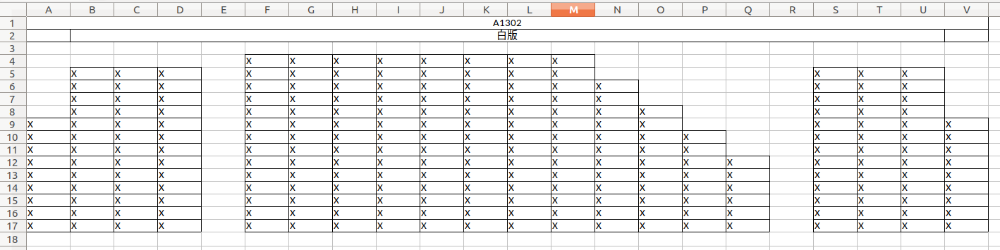
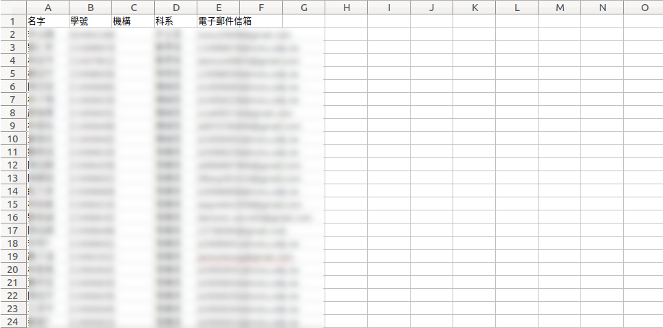
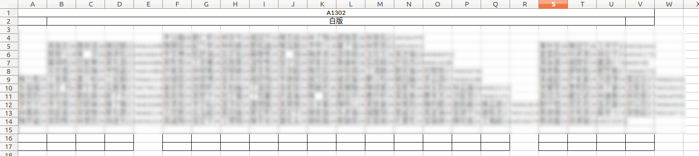

# seat-them

## Setup

```bash
$ git clone git@github.com:aben20807/seat-them.git
$ cd seat-them/

$ virtualenv env -p python3
$ source env/bin/activate
$ pip install openpyxl
```

## Usage

+ `seat.xlsx`: mark all valid seats with `X`.
+ `student.xlsx`: the list of course students (required columns are 名字 and 學號).
+ `new_seat.xlsx`: the result created by this script.

```bash
$ python3 seat_them.py
```


## Screenshot

+ 
+ 
+ 
